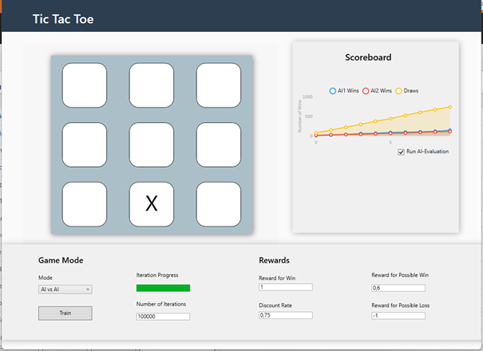
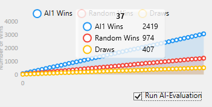
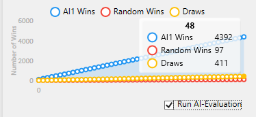
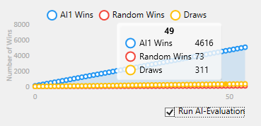

# AI-TicTacToe
Tic Tac Toe Opponent trained with AI (Q-Learning)

# Entwicklung einer künstlichen Intelligenz für TicTacToe

**Julius Steinbach**  
Modul: KI für Spiele  
Betreuer: Prof. Dr. Christof Rezk-Salama  
Trier, 15.02.2025

## 1 Motivation

Tic-Tac-Toe gilt als eines der simpelsten Spiele, bietet jedoch eine überraschende mathematische Komplexität und eignet sich hervorragend zur Untersuchung der Anwendung von künstlicher Intelligenz (KI) in der Spieleentwicklung. Mit über 5500 möglichen Spielzuständen erfordert das Spiel eine durchdachte Strategie, um optimale Entscheidungen zu treffen.

Ziel dieses Projekts war die Entwicklung einer KI, die auf einem menschlichen Niveau spielt. Die KI sollte aus Erfahrungen lernen und auf dieser Basis Entscheidungen treffen. Der Fokus lag auf der Implementierung des Q-Learning-Algorithmus, einem Reinforcement-Learning-Ansatz, der durch Belohnungen und Bestrafungen das Lernen ermöglicht. Die Leistung der KI wurde anhand objektiver Kriterien wie Sieg- und Niederlagestatistiken bewertet.

Das persönliche Ziel bestand darin, das Verständnis für KI-Entwicklung zu vertiefen und vorhandenes Wissen in einer praktischen Anwendung zu testen.

## 1.1 Softwarearchitektur
Der Softwareaufbau basiert auf den Kernklassen: MainWindow, Game, GameBoard
und Score. Diese Kernklassen nutzen dabei die durch Herrn Professor Rezk-Salama
bereitgestellten Klassen QLearning und QTable, sowie die Interfaces IAction und
IGameState, welche eine generische Implementierung einer Q-Learning KI sind.
Im folgenden werden die erstellten Klassen vorgestellt:

### 1.1.1 Score

Die Klasse Score dient der Speicherung und Verwaltung der Spielergebnisse. Sie
speichert die Anzahl der Siege, Niederlagen und Unentschieden für beide Spieler
sowie die Gesamtanzahl der gespielten Partien. Diese Klasse ist essenziell, um den
Fortschritt der KI während des Trainings und der Evaluation zu verfolgen.

### 1.1.2 GameBoard

Die Klasse GameBoard repräsentiert das Spielfeld. Sie verwendet ein zweidimensio-
nales Array, um Spielsteine und leere Felder zu speichern. Standardmäßig beträgt
die Spielfeldgröße 3x3, kann jedoch durch den Konstruktor angepasst werden.

**Funktionen:**
- `Konstruktor`: Erstellt ein leeres oder vordefiniertes Spielfeld
- `SetFieldPosition(x, y, tile)': Setzt einen Spielstein an eine Position.
- `GetFieldPosition(x, y)` Gibt das Symbol an einer Position zurück.
- `CheckEmpty(x, y)` Prüft, ob ein Feld leer ist.
- `EmptyBoard()`: Setzt das Spielfeld zurück.

### 1.1.3 Game

Die Klasse Game implementiert IGameState und verwaltet den Spielablauf von Tic-
Tac-Toe. Der Konstruktor initialisiert das Spielfeld und die möglichen Aktionen.
Die Methode Move führt einen Zug aus und überprüft den Spielstand. Sie vergibt
Belohnungen für gute Züge oder Strafen für Fehler, was für Q-Learning wichtig
ist. PossibleActions gibt alle möglichen Züge zurück. HasWon und HasDrawn prü-
fen den Spielstand. Die Id-Eigenschaft erzeugt eine eindeutige Repräsentation des
aktuellen Zustands für das KI-Training. Das Spiel erkennt drohende Siege oder
Verluste (CouldWinNext, BlocksWinningMove) und belohnt oder bestraft die KI
entsprechend. Reset setzt das Spiel zurück. Die ExecuteAction-Methode verarbei-
tet Spielzüge basierend auf übergebenen Aktionen. CheckValidTileCount stellt
sicher, dass die Spielfeldverteilung gültig ist.

### 1.1.4 MainWindow

Die Klasse MainWindow bildet das Spielbrett ab und bietet die Möglichkeit zur
Analyse und Konfiguration der KI (siehe Abbildung 1.1). Sie unterstützt drei
Spielmodi: Player vs. AI, AI vs. AI und Player vs. Random. Die Benutzerober-
fläche ermöglicht es dem Nutzer, zwischen den Modi zu wechseln, das Training der
KI zu starten und die Ergebnisse zu analysieren. Zudem wird ein „Ai-Evaluation“
Modus angeboten, mit dem das Spielverhalten der KI analysiert werden kann. Die
Statistik der gespielten Spiele wird dabei in einem Chart übersichtlich dargestellt.

## 1.2 Spielmodi

### 1.2.1 AI vs AI

Der Modus AI vs. AI dient primär dem Training der beiden KIs. In diesem Modus
spielen die beiden KIs gegeneinander, um durch wiederholte Spiele und die An-
wendung des Q-Learning-Algorithmus zu lernen. Der Nutzer hat die Möglichkeit,
das Training zu konfigurieren und den Fortschritt zu überwachen.

**Konfiguration:**
- `Number of Iterations`: Hier legt der Nutzer fest, wie viele Trainingsitera-
tionen durchgeführt werden sollen. Eine Iteration entspricht einem Spielzug.
Dieser Wert wird in der Methode StartTraining ausgelesen und bestimmt,
wie oft die Methode LearnStep aufgerufen wird.
- `Discount Rate`: Dieser Parameter beeinflusst, wie stark die KI zukünftige Be-
lohnungen im Vergleich zu unmittelbaren Belohnungen gewichtet. Ein höherer
Wert bedeutet, dass die KI langfristige Strategien bevorzugt. Der Wert wird in
der Methode DiscountRateTextChanged aktualisiert.
- `Reward for Win`, `Reward for Possible Win`, `Reward for Possible Loss`: Diese Werte definieren die Belohnungen, die die KI für bestimmte Spielsituationen erhält. Beispielsweise erhält die KI eine hohe Belohnung für einen Sieg, eine moderate Belohnung für eine drohende Gewinnchance und eine Strafe (negativer Reward) für eine drohende Niederlage. Diese Werte werden in der Methode StartTraining ausgelesen und an die KI übergeben.

**Ablauf:**
Das Training wird durch einen Klick auf den Button Train gestartet. Im Hinter-
grund wird die Methode StartTraining ausgeführt, die einen Timer startet. Die-
ser Timer ruft in festgelegten Abständen (Ticks) die Methode LearnStep auf, die
den Q-Learning-Algorithmus ausführt. Der Fortschritt des Trainings wird durch
eine Progress Bar visualisiert, sodass der Nutzer den aktuellen Stand des Trainings
verfolgen kann.

**Evaluation:**
Nach Abschluss des Trainings kann der Nutzer
den AI-Evaluation-Modus aktivieren, um das Spielverhalten der trainierten KIs zu
testen. In diesem Modus spielen die beiden KIs gegeneinander, dabei werden die
Ergebnisse auf dem Scorebaord angezeigt. Die Statistik zeigt die Anzahl der Siege
für jede KI sowie die Anzahl der Unentschieden. Dies ermöglicht es dem Nutzer,
die Leistung der KIs zu analysieren und zu bewerten, wie gut sie gelernt haben,
strategisch zu spielen.

### AI vs Random

Der Modus AI vs. Random dient dazu, die Leistung der trainierten KI gegen einen
zufällig agierenden Gegner zu bewerten. Dieser Modus ist besonders nützlich, um
zu überprüfen, ob die KI effektiv gelernt hat, strategisch zu spielen, und ob sie in
der Lage ist, einen zufällig agierenden Gegner zu besiegen. Eine gut trainierte KI
sollte gegen ein Zufallsgegner deutlich häufiger gewinnen als verlieren.

**Ablauf:**
- Die KI spielt automatisch gegen einen Gegner, der zufällige Züge ausführt. Der
Nutzer hat keine Möglichkeit, direkt in das Spiel einzugreifen.
- Der Modus kann erst aktiviert werden, nachdem die KI im AI vs. AI-Modus
trainiert wurde.
- Das Spieltempo ist im Evaluation-Modus erhöht, sodass viele Spiele in kurzer
Zeit durchgeführt werden können. Dies ermöglicht eine schnelle und effiziente
Bewertung der KI-Leistung.

### 1.2.2 Player vs AI

Der Modus Player vs. AI ermöglicht es dem Nutzer, selbst gegen die trainierte KI
zu spielen. Dieser Modus ist interaktiv und bietet dem Nutzer die Möglichkeit, das
Spielverhalten der KI direkt zu erleben.

**Ablauf:**
- Die Benutzeroberfläche wartet auf Input durch den Nutzer, der durch einen
Klick auf eines der Spielfelder einen Zug ausführt.
- Jeder Klick auf ein Spielfeld löst die Methode ClickTile aus. Diese Methode
ermittelt die Position des geklickten Feldes (Zeile und Spalte) und führt den
Zug des Spielers aus.`
- Anschließend wird die Methode TryExecuteAction der Klasse TicTacToe auf-
gerufen, um den Zug zu verarbeiten.
- Nachdem der Spieler seinen Zug ausgeführt hat, führt die KI ihren Zug aus,
indem die Methode LearnStep aufgerufen wird.
- Ist das Spiel beendet (entweder durch einen Sieg oder ein Unentschieden), wird
das Spielfeld zurückgesetzt, und die Benutzeroberfläche wartet erneut auf Input
durch den Nutzer.

## 1.3 Analyse der Ergebnisse
Die entwickelte KI wurde in mehreren Tests evaluiert, um ihre Leistungsfähigkeit
und den Lernerfolg zu überprüfen. Die Ergebnisse zeigen, dass die KI durch den
Q-Learning-Algorithmus effektiv lernt und ihre Spielstärke mit zunehmender Trai-
ningsdauer deutlich verbessert. Im Folgenden werden die durchgeführten Tests und
die daraus gewonnenen Erkenntnisse beschrieben.

### 1.3.1 Gegen zufälligen Gegner
Um die Leistung der KI zu bewerten, wurde sie zunächst gegen einen zufällig
agierenden Gegner antreten lassen. Die KI wurde mit 100.000 Iterationen trainiert
und mit folgender Konfiguration getestet:

- Konfiguration:
  - Reward for Win: 1
  - Discount Rate: 0,75
  - Reward for Possible Win: 0,6
  - Reward for Possible Loss: -1
 
  

**Ergebnis:**  
Das Ergebnis war sehr positiv: Nach 4900 Spielen gewann die KI 4392 Mal, wäh-
rend sie nur 97 Mal verlor. Dies entspricht einer Siegquote von 87%. Die hohe Siegquote zeigt, dass die KI in der Lage ist, effektive Strategien zu entwickeln und den zufälligen Gegner deutlich zu übertreffen. Dies bestätigt, dass der Q-Learning-
Algorithmus erfolgreich angewendet wurde und die KI aus ihren Erfahrungen lernt.

### 1.3.2 Zwei KIs gegeneinander

In einem weiteren Test traten zwei trainierte KIs gegeneinander an. Nach 2700
Spielen endeten 2097 Spiele unentschieden. Nur in wenigen Fällen konnte eine der
KIs die Oberhand gewinnen. Dies deutet darauf hin, dass beide KIs gleichermaßen
gut trainiert sind und durch ihr intelligentes Spielverhalten häufig in eine Pattsi-
tuation geraten.

  

### 1.3.3 Einfluss der Iterationen
Um den Einfluss der Trainingsdauer auf den Lernerfolg der KI zu untersuchen,
wurden drei KIs mit unterschiedlichen Iterationsanzahlen trainiert, um diese dann
gegen einen zufällig agierenden Gegner zu testen. Dabei sind folgende Ergebnisse
entstanden:

  

  
- 1.000 Iterationen: 63 %
- 100.000 Iterationen: 87 %
- 1.000.000 Iterationen: 92 %

Diese Ergebnisse zeigen, dass eine höhere Anzahl von Iterationen das Lernen der
KI deutlich fördert. Allerdings ist auch festzustellen, dass die KI bereits mit re-
lativ wenigen Iterationen (1.000) ein intelligentes Spielverhalten entwickelt und
eine beachtliche Siegquote erzielt. Dies deutet darauf hin, dass der Q-Learning-
Algorithmus auch bei begrenzten Ressourcen effektiv ist.

## 1.4 Reflexion

Die Ergebnisse sind sehr zufriedenstellend. Die KI zeigt eine hohe Gewinnquote
gegen zufällige Gegner, was ihre Fähigkeit unterstreicht, aus Erfahrungen zu ler-
nen und strategisch zu handeln. Im KI-gegen-KI-Modus enden die meisten Spiele
unentschieden, was auf ein intelligentes und ausgeglichenes Spielverhalten hindeu-
tet. Auch im Player-vs.-AI-Modus bekommt man ein Gefühl für das intelligente
Spielverhalten der KI. Der Vergleich von KIs mit unterschiedlichen Iterationsan-
zahlen zeigt, dass mehr Training die Leistung deutlich steigert. Selbst mit wenigen
Iterationen entwickelt die KI bereits ein intelligentes Spielverhalten, das sich mit
zunehmendem Training weiter verbessert.

Ein interessanter Aspekt für zukünftige Untersuchungen wäre die Feinabstimmung
der Belohnungsparameter. Es wäre möglich, dass eine andere Konfiguration der
Werte für Reward for Win, Reward for Possible Win und Reward for Possible
Loss noch bessere Ergebnisse erzielen könnte. Allerdings erwies sich die optimale
Verteilung dieser Rewards während der Entwicklung als eine der größten Hürden,
da bereits kleine Änderungen erhebliche Auswirkungen auf das Lernverhalten der
KI hatten. Insgesamt hat das Projekt nicht nur praktische Erfahrungen in der KI-
Entwicklung vermittelt, sondern auch gezeigt, wie komplexe Konzepte der künst-
lichen Intelligenz in einem scheinbar einfachen Spiel wie Tic-Tac-Toe erfolgreich
umgesetzt werden können. Die Konfrontation mit diesen Problemen verdeutlichte
mir, wie wichtig kontinuierliches Finetuning und iterative Anpassungen in der KI-
Entwicklung sind. Gleichzeitig bestätigte es meine Annahme, dass die KI ein sehr
komplexes, aber faszinierendes Gebiet der Informatik ist.

